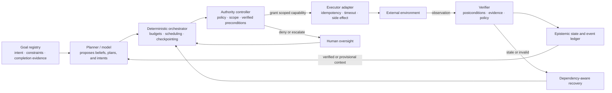

# Agent Runtime Loop

```mermaid
flowchart LR
    G["Goal registry<br/>intent · constraints · completion evidence"] --> P["Planner / model<br/>proposes beliefs, plans, and intents"]
    P --> O["Deterministic orchestrator<br/>budgets · scheduling · checkpointing"]
    O --> A["Authority controller<br/>policy · scope · verified preconditions"]
    A -->|"grant scoped capability"| X["Executor adapter<br/>idempotency · timeout · side effect"]
    A -->|"deny or escalate"| H["Human oversight"]
    X --> E["External environment"]
    E -->|"observation"| V["Verifier<br/>postconditions · evidence · policy"]
    V --> M["Epistemic state and event ledger"]
    M -->|"verified or provisional context"| P
    V -->|"stale or invalid"| R["Dependency-aware recovery"]
    R --> O
    H --> O
```

The model proposes actions; it does not directly grant itself execution authority or promote observations to verified state.
