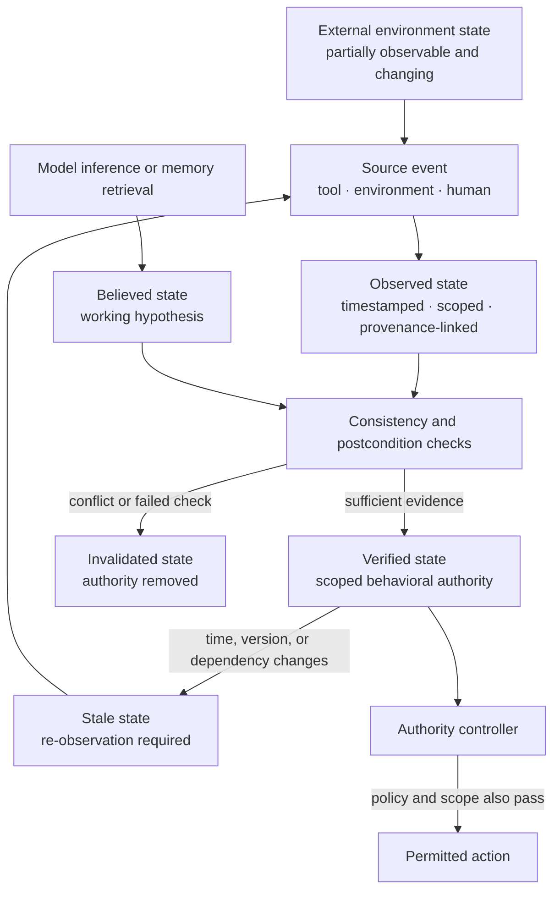

# Model Belief Versus External State

```mermaid
flowchart TB
    W["External environment state<br/>partially observable and changing"] --> S["Source event<br/>tool · environment · human"]
    S --> O["Observed state<br/>timestamped · scoped · provenance-linked"]
    L["Model inference or memory retrieval"] --> B["Believed state<br/>working hypothesis"]
    O --> C["Consistency and postcondition checks"]
    B --> C
    C -->|"sufficient evidence"| V["Verified state<br/>scoped behavioral authority"]
    C -->|"conflict or failed check"| I["Invalidated state<br/>authority removed"]
    V -->|"time, version, or dependency changes"| T["Stale state<br/>re-observation required"]
    T --> S
    V --> Q["Authority controller"]
    Q -->|"policy and scope also pass"| A["Permitted action"]
```

Verification is not authorization: policy, scope, impact, and reversibility remain separate checks.
