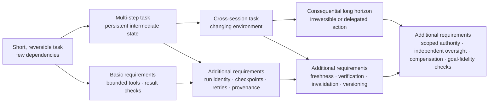

# Increasing Horizon and Reliability Requirements

The diagram expresses a working design expectation, not an empirical scaling law. Experiments should test which requirements matter at which horizons and impacts.
