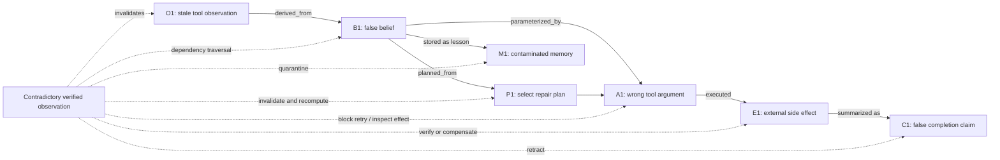

# Corrupted-State Propagation and Recovery

A command-local retry addresses A1 but leaves B1, P1, C1, and M1 contaminated. Dependency-aware recovery attempts to identify the affected subgraph and the already-realized external effects.
