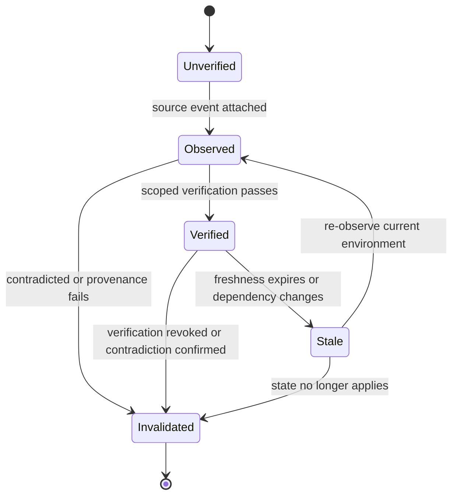

# Epistemic-State Transition

This is a simplified projection of the [two-axis epistemic model](../concepts/epistemic-state.md). Planned and believed are record roles; unverified, verified, stale, and invalidated are statuses. An observation is evidence and does not become verified implicitly.
