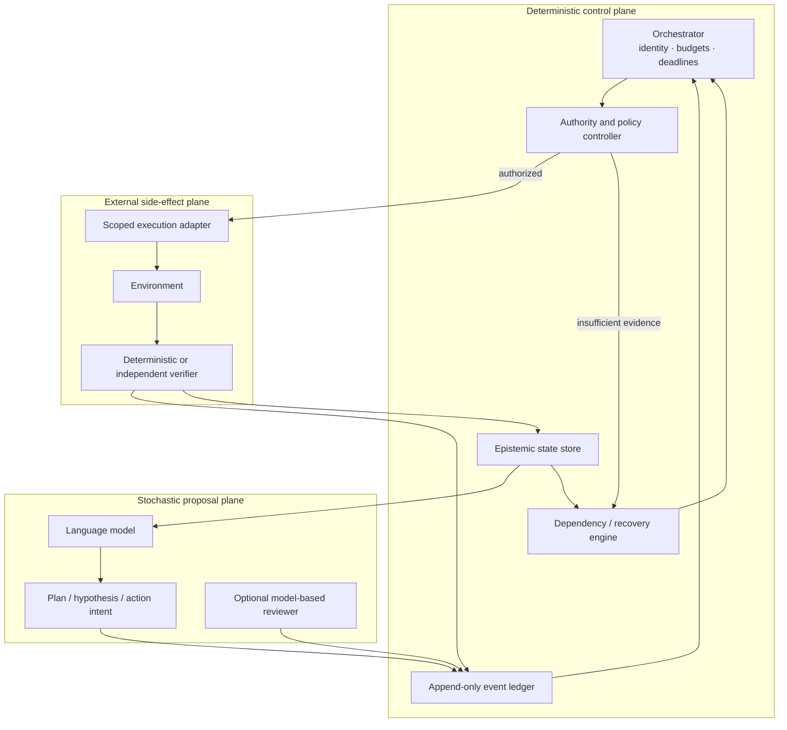

# Hybrid Deterministic–Stochastic Runtime

“Deterministic control” means that control decisions can be reconstructed from recorded events and explicit rules. It does not assume that external systems, validators, or model outputs are always correct.
