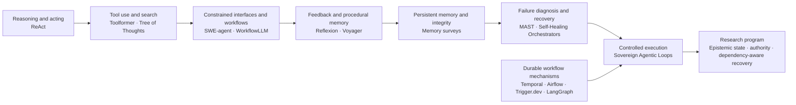

# Research-Literature Landscape

```mermaid
flowchart LR
    A["Reasoning and acting<br/>ReAct"] --> B["Tool use and search<br/>Toolformer · Tree of Thoughts"]
    B --> C["Constrained interfaces and workflows<br/>SWE-agent · WorkflowLLM"]
    C --> D["Feedback and procedural memory<br/>Reflexion · Voyager"]
    D --> E["Persistent memory and integrity<br/>Memory surveys"]
    E --> F["Failure diagnosis and recovery<br/>MAST · Self-Healing Orchestrators"]
    F --> G["Controlled execution<br/>Sovereign Agentic Loops"]
    H["Durable workflow mechanisms<br/>Temporal · Airflow · Trigger.dev · LangGraph"] --> G
    G --> I["Research program<br/>Epistemic state · authority · dependency-aware recovery"]
```

The arrows indicate a conceptual path through the starting corpus, not chronological priority or proof that each work directly builds on the previous one.
